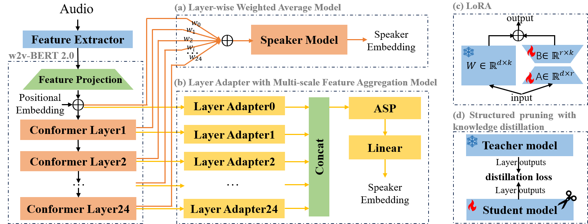
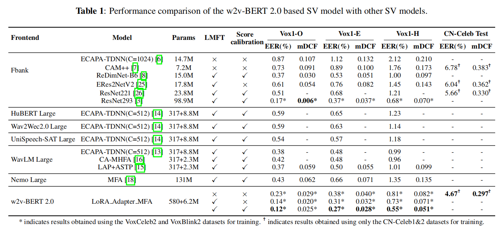
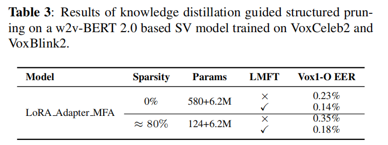

# Enhancing Speaker Verification with W2V-BERT 2.0 and Knowledge Distillation-Guided Structured Pruning



### Preparation Stage

Download the W2V-BERT 2.0 pre-trained weights from Hugging Face and place them in the designated directory:

```
URL: https://huggingface.co/facebook/w2v-bert-2.0/blob/main/model.safetensors
Destination folder: deeplab/pretrained/audio2vector/ckpts/facebook/w2v-bert-2.0/
```

### Train Stage

**Stage1: Pre-trained model freeze training**

```
OMP_NUM_THREADS="16" CUDA_VISIBLE_DEVICES="0,1,2,3,4,5,6,7"  \
torchrun --nnodes 1 --nproc_per_node=8 --master_port=12885 train.py \
--tag vox2_ \
--is_distributed true \
--yaml conf/w2v-bert/s1.yaml
```

**Stage2: Joint fine-tuning**

```
# Merging LoRA module parameters into the pre-trained model
cd utils
python3 lora_merge.py

OMP_NUM_THREADS="16" CUDA_VISIBLE_DEVICES="0,1,2,3,4,5,6,7"  \
torchrun --nnodes 1 --nproc_per_node=4 --master_port=12885 train.py \
--tag vox2_ \
--is_distributed true \
--yaml conf/w2v-bert/s2.yaml \
--pretrain /path/stage1/lora_merge.pth
```

**Stage3: large margin fine-tuning**

```
OMP_NUM_THREADS="16" CUDA_VISIBLE_DEVICES="0,1,2,3,4,5,6,7"  \
torchrun --nnodes 1 --nproc_per_node=4 --master_port=12885 train.py \
--tag vox2_ \
--is_distributed true \
--yaml conf/w2v-bert/s3.yaml \
--pretrain /path/stage2/best_ckpt.pth
```



### Prune Stage

**Stage1: knowledge distillation guided structured pruning**

```
OMP_NUM_THREADS="12" CUDA_VISIBLE_DEVICES="0,1,2,3,4,5,6,7"  \
torchrun --nnodes 1 --nproc_per_node=8 --master_port=12885 train_prune_s1.py \
--tag prune_ \
--is_distributed true \
--yaml conf/prune/dis_prune_s1.yaml
```

**Stage2: further distillation**

```
cd utils
python3 apply_prune_s1.py

OMP_NUM_THREADS="12" CUDA_VISIBLE_DEVICES="0,1,2,3,4,5,6,7"  \
torchrun --nnodes 1 --nproc_per_node=8 --master_port=12885 train_prune_s2.py \
--tag prune_ \
--is_distributed true \
--yaml conf/prune/dis_prune_s2.yaml \
--pretrain /path/prune_stage1/prune_update.pth
```

**Stage2: further fine-tuning**

```
cd utils
python3 apply_prune_s2.py

OMP_NUM_THREADS="16" CUDA_VISIBLE_DEVICES="0,1,2,3,4,5,6"  \
torchrun --nnodes 1 --nproc_per_node=8 --master_port=12886 train.py \
--tag prune_ft_ \
--is_distributed true \
--yaml conf/prune/s1.yaml \
--pretrain /path/prune_stage2/prune_dis.pth

OMP_NUM_THREADS="16" CUDA_VISIBLE_DEVICES="0,1,2,3,4,5,6,7"  \
torchrun --nnodes 1 --nproc_per_node=8 --master_port=12886 train.py \
--tag prune_ft_ \
--is_distributed true \
--yaml conf/prune/s2.yaml \
--pretrain /path/prune_ft_stage1/best_ckpt.pth

OMP_NUM_THREADS="16" CUDA_VISIBLE_DEVICES="0,1,2,3"  \
torchrun --nnodes 1 --nproc_per_node=4 --master_port=12886 train.py \
--tag prune_ft_ \
--is_distributed true \
--yaml conf/prune/s3.yaml \
--pretrain /path/prune_ft_stage2/best_ckpt.pth

```



### Test stage

```
cd utils
python3 get_embd_w2v.py
```


